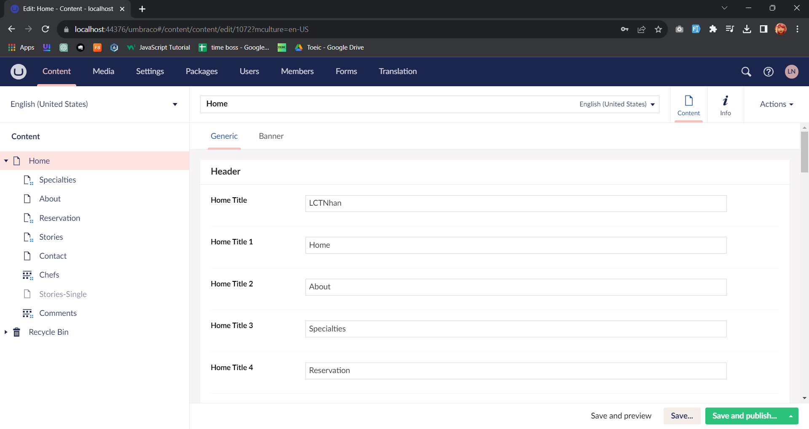
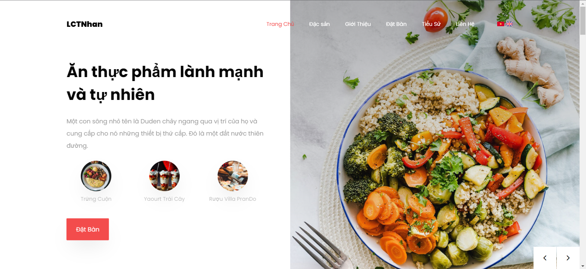
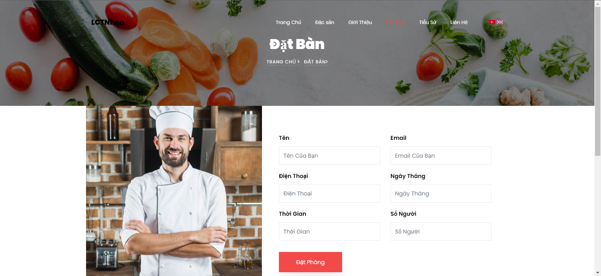

# UmbracoFood

Chào mừng bạn đến với UmbracoFood!

# Sự miêu tả

UmbracoFood là một dự án đơn giản và tuyệt vời thể hiện sức mạnh của công nghệ. Việc sử dụng Umbraco để xây dựng trang web nhà hàng sẽ giúp bạn có một giao diện quản trị linh hoạt và dễ sử dụng để quản lý nội dung trang web của mình.

# Chuẩn bị

Cài đặt Umbraco CMS: Trước tiên, bạn cần cài đặt Umbraco CMS trên máy chủ hoặc máy tính cá nhân của mình. Bạn có thể tải Umbraco từ trang web chính thức và làm theo hướng dẫn cài đặt.

# Cài Đặt

1. Clone repository về máy tính của bạn:
2. Cài đặt Umbraco CMS bằng cách chạy trình cài đặt bên trong thư mục dự án.
3. Mở trình duyệt và truy cập địa chỉ `http://localhost/umbraco` để tiến hành cài đặt Umbraco.
    lecao11102001@gmail.com 
    nhan11102001

4. Sau khi cài đặt thành công, truy cập trang quản trị Umbraco để tùy chỉnh nội dung và cấu hình trang web.

# Thiết kế website

Xác định cấu trúc trang web: Xác định cấu trúc trang web của nhà hàng của bạn, bao gồm trang chủ, trang menu, trang giới thiệu, trang đặt bàn, trang tiểu sử, trang liên hệ và các trang khác mà bạn muốn có trên trang web.
Thiết kế giao diện người dùng: Tạo giao diện người dùng hấp dẫn và chuyên nghiệp cho trang web của bạn. Bạn có thể sử dụng HTML, CSS và JavaScript để thiết kế giao diện trước.

# Xây dựng trang web trên Umbraco:

Tạo các loại nội dung: Trong Umbraco, bạn có thể tạo các loại nội dung, chẳng hạn như trang, bài đăng, danh mục, v.v. Dựa vào cấu trúc trang web đã xác định, tạo các loại nội dung tương ứng trong Umbraco.
Tùy chỉnh trang điều hướng: Sử dụng trình chỉnh sửa nội dung của Umbraco để tạo menu và liên kết tới các trang đã tạo.
Thêm nội dung: Thêm nội dung vào các trang, chẳng hạn như giới thiệu nhà hàng, menu, thông tin liên hệ, hình ảnh, v.v.

# Tùy chỉnh:

Tùy chỉnh giao diện: Tùy chỉnh giao diện trang web bằng cách sử dụng các tệp CSS và JavaScript để đảm bảo trang web có diện mạo phù hợp với hình ảnh nhà hàng của bạn.
Tùy chỉnh hình ảnh và video: Thêm hình ảnh và video của nhà hàng vào trang web.

# Giao diện
    Trang chủ

    Trang đặt bàn

